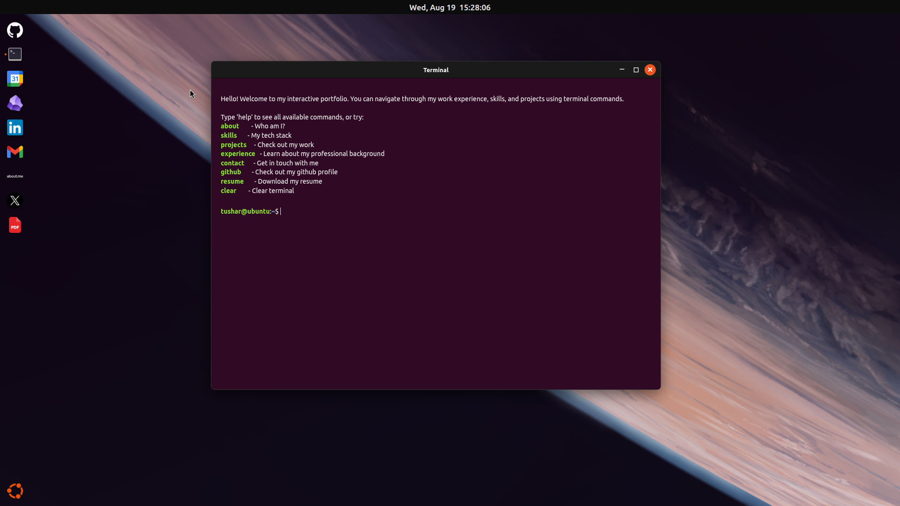

# Interactive OS Portfolio

A fully functional, web-based operating system clone built to showcase my projects, skills, and experience as a Backend Engineer. 

 

This project is a highly interactive, Ubuntu-inspired desktop environment built with React. It features a custom window manager, draggable and resizable applications, and a fully functional command-line interface.

## Tech Stack

<p>
  
  
  
</p>

* **Framework:** React.js
* **Styling:** SCSS (Custom CSS variables for theming)
* **Window Management:** `react-rnd`

---

## Installation

To run this OS portfolio locally on your machine:

1. **Clone the repository:**
   ```bash
   git clone [https://github.com/Tusharsoni3/Tushar-portfolio.git](https://github.com/Tusharsoni3/Tushar-portfolio.git)
   cd Tushar-portfolio
   npm install
   npm run dev
